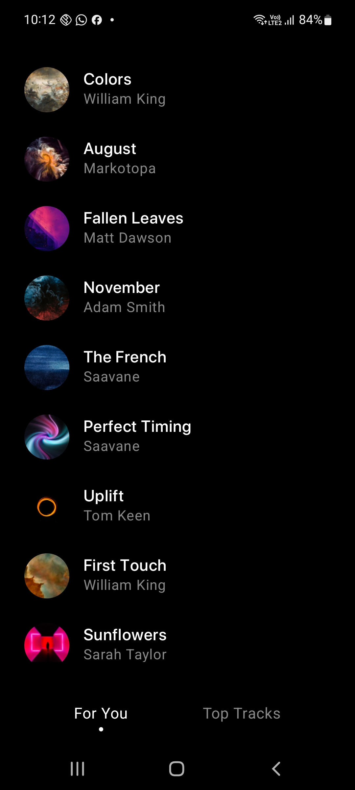

<h1>Space Tunes</h1>
<h3>A Music Streaming Platform by Samespace</h3>
<h4>A video demonstrating the application can be found here : https://drive.google.com/file/d/17-w22Qu49bTw9rnQ3MtZYNJ8h7bMW2ix/view?usp=sharing </h4>

Screenshots from the application : 

|  |  | | |  |
|----------|:----------:|:--------:|:---------:|:---------:|

<h3>Architecture Used</h3>

## Tech stack 

- [Kotlin][1] based
- [ExoPlayer][2] for playing multimedia files
- [Coroutines][3] for asynchronous.
- [Compose][4] - Modern toolkit for building native UI.
- [Lifecycle][5] - Create a UI that automatically responds to lifecycle events.
- [LiveData][6] - Notify domain layer data to views.
- [Navigation][7] - Handle everything needed for in-app navigation.
- [ViewModel][8] - UI related data holder, lifecycle aware.
- [Hilt][9] - For [dependency injection][10].
- [Coil][11] - An image loading library for Android backed by Kotlin Coroutines.

[1]: https://kotlinlang.org/
[2]: https://github.com/google/ExoPlayer
[3]: https://kotlinlang.org/docs/reference/coroutines-overview.html
[4]: https://developer.android.com/jetpack/compose
[5]: https://developer.android.com/topic/libraries/architecture/lifecycle
[6]: https://developer.android.com/topic/libraries/architecture/livedata
[7]: https://developer.android.com/jetpack/compose/navigation
[8]: https://developer.android.com/topic/libraries/architecture/viewmodel
[9]: https://dagger.dev/hilt/
[10]: https://developer.android.com/training/dependency-injection/hilt-android
[11]: https://github.com/coil-kt/coil

## Features

- Jetpack Compose UI. 
- Jetpack Compose Navigation
- MVVM Architecture
- Dependency injection with Hilt
- Retrieves Music from the network using Retrofit 
- Allows background playback using a foreground service
- Media style notifications
- Uses a MediaBrowserService to control and expose the current media session
- Controls the current playback state with actions such as: play/pause, Swip bottom bar to skip next/previous, skip to next/previous and stop

## Future Scope

- Pagination 
- Caching (Client Side)  
- Animations 
- Code Optimisations
- Unit Testing 

## Tested on devices 

- Oneplus 9 pro 
- Samsung S20 FE
- Samsung A31 
- Samsung M31s 

Disclaimer - The above code consists of system-generated files and does not have source code within. This was caused due to a system-failure at my end, causing all the source files to be deleted. 
